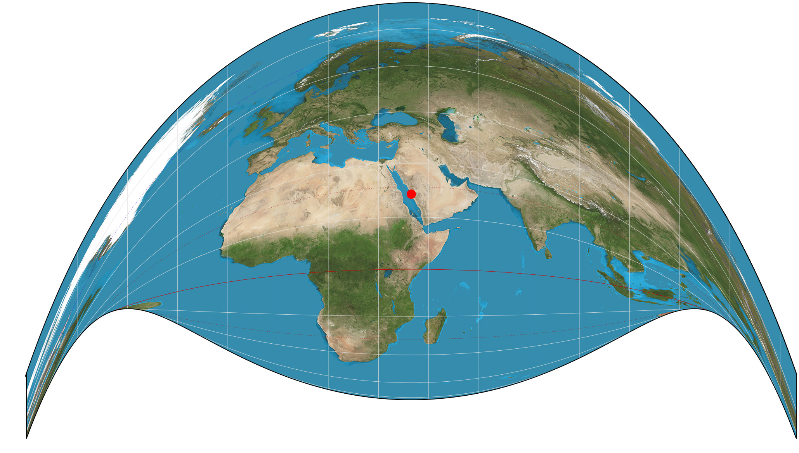
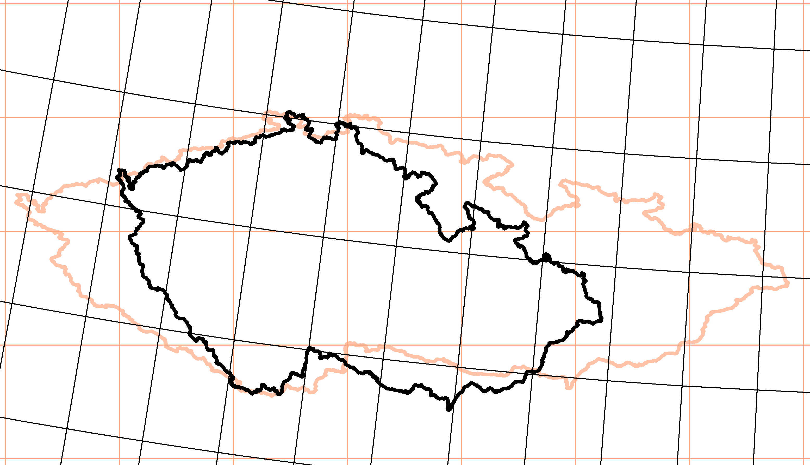

## Geospatial analytics in Python

October 2018

<small>Christopher Prince</small>

---

### Topics

<section style="text-align: left;">

What we'll cover:
* <!-- .element: class="fragment fade-up" -->Spatial data formats
* <!-- .element: class="fragment fade-up" -->Feature creation
* <!-- .element: class="fragment fade-up" -->Map projections
* <!-- .element: class="fragment fade-up" -->Plotting
* <!-- .element: class="fragment fade-up" -->Spatial operations and manipuation
* <!-- .element: class="fragment fade-up" -->Statistical methods

<!-- .element: class="fragment fade-up" -->What we won't cover:
* <!-- .element: class="fragment fade-up" -->Interfaces to GIS packages (like QGIS or ArcGIS)

---

### Geopandas installation

Installation is a *lot* easier than it used to be. Both <code>pip</code> and <code>conda</code> should take care of the dependencies you will need.

It's still not a 1.0 release, though, so it's a good idea to setup a seperate environment for it.

If you use the PUI kernels on <code>ARDF</code>, the installation is already taken care of!

- -

### What is geopandas?

Geopandas is the GIS-extension of <code>pandas</code>. Two new classes, <code>GeoSeries</code> and <code>GeoDataFrame</code> extend the functionality of the pandas data structures. It also builds on other python spatial packages to perform manipulation and analysis:

* fiona
* shapely
* pyproj
* rtree
* pysal

- -

### GeoDataFrame

A special column of the dataframe contains the shape information associated with each geometry. Helpfully, this is accessed via <code>gdf.geometry</code>.

Additionally, a _coordinate reference system_ may be stored as a property of the GeoDataFrame: <code>gdf.crs</code>. 

- -

### Use with Pandas!

Methods are defined on GeoDataFrames (and GeoSeries) to perform manipulations and calculations. Importantly, because GeoDataFrames are extensions of DataFrames, all of the same methods available to DataFrames can be used with GeoDataFrames.

---

### Fiona

Fiona reads and writes GIS files in various formats. 99.9% of the time you will be working with either:
* *Shapefile*: Actually a set of database files, though it's common to refer to just the \*.shp file. Other attributes and metadata are stored in (necessary) supplemental files.
* *GeoJSON*: A JSON file with additional geometry attributes, and possibly a metadata header.

- -

### GeoJSON example

<pre><code>
{
  "type": "Feature",
  "geometry": {
    "type": "Point",
    "coordinates": [125.6, 10.1]
  },
  "properties": {
    "name": "Dinagat Islands"
  }
}
</code></pre>

- -

### Reading files

Geopandas uses Fiona as a dependency, and calls it directly, so you usually don't need to import it seperately.

<pre><code>
import geopandas as gpd
gpd.read_file('path/to/shapefile.shp')
</code></pre>

---

### Shapely

Shapely is a python library for geometric operations using the GEOS library.

Shapely can perform:
* geometry validation
* geometry creation (e.g. collections)
* geometry operations
  
- -

### Geometry creation

Shapely supports the creation of primitive geometry features. These include:

<code>
* Point
* LineString
* LinearRing
* Polygon</code>

Multipart collections are also supported: <code>MultiPoint, MultiLineString</code> and <code>MultiPolygon</code>

- -

### Geometry creation

A common use case is to create geometric points from a set of Latitudes and Longitudes:

<pre>
from shapely.geometry import Point
from geopandas import GeoDataFrame

pointData = pd.read_csv('somefilewithlatlongs.csv')
pointData.lonlat = list(zip(pointData.lon, pointData.lat))
pointData['geometry'] = pointData.lonlat
                                 .applymap(lambda x: Point(x))
pointData = GeoDataFrame(pointData)    # Gives the geometry 
                                       # column special powers!
</pre>

- -
### Shapely geometric operations

<small style="text-align: left;">source: http://kjordahl.github.io/SciPy-Tutorial-2015/</small>

- -
### Shapely geometric operations

<small style="text-align: left;">source: http://kjordahl.github.io/SciPy-Tutorial-2015/</small>

- -
### Shapely geometric operations

<small style="text-align: left;">source: http://kjordahl.github.io/SciPy-Tutorial-2015/</small>
  
- -
### Shapely geometric operations

<small style="text-align: left;">source: http://kjordahl.github.io/SciPy-Tutorial-2015/</small>
  
- -
### Shapely geometric operations
<pre><code>
from shapely.geometry import LineString
line = LineString([(0, 0), (1, 1), (0, 2), (2, 2), (3, 1), (1, 0)])
dilated = line.buffer(0.5)
eroded = dilated.buffer(-0.3)
</code></pre>

<small style="text-align: left;">source: http://kjordahl.github.io/SciPy-Tutorial-2015/</small>
 
- -
### Binary predicates 
<code>object.almost_equals(other[, decimal=6])</code>
<code>object.contains(other)</code>
<code>object.crosses(other)</code>
<code>object.disjoint(other)</code>
<code>object.equals(other)</code>
<code>object.intersects(other)</code>
<code>object.touches(other)</code>
<code>object.within(other)</code>
<footer class="source"><a href=http://toblerity.github.io/shapely/manual.html#binary-predicates>details</a></footer></article>

- -

## Let's try it!

---

### Geographic projection

<iframe width="784" height="443" src="https://www.youtube.com/embed/vVX-PrBRtTY?rel=0&amp;controls=0&amp;showinfo=0&amp;start=46" frameborder="0" allowfullscreen></iframe><!-- .element: class="fragment" data-fragment-index="1" -->
<small>https://youtu.be/vVX-PrBRtTY?t=46s</small><!-- .element: class="fragment" data-fragment-index="1" -->

- -

<small>Mercator projection (1569)</small>
- -

<small>Craig retroazimuthal projection (1909)</small>

- -

<small>Křovák's projection (black) versus WGS84 projection (orange)</small>

- -

### pyproj

Pyproj provides an interface to the PROJ.4 library which performs the transformations between coordinate reference systems (CRS). This can be done explicitly by specifying datums, geodetic ellipse, origin, and other parameters in a "PROJ4 string".

Many common projections are indexed with a numerical code from the European Petroleum Survey Group, and using these is generally much simpler with fiona.

- -

### projection example
<section style="text-align: left;">

PROJ.4 string (North American Equidistant Conic):
<code>naec = '+proj=eqdc +lat_0=40 +lon_0=-96 +lat_1=20 +lat_2=60 +x_0=0 +y_0=0 +datum=NAD83 +units=m +no_defs'</code>

Fiona EPSG 4326 (WGS84 lat/long):

<code>
from fiona.crs import from_epsg
states.crs = from_epsg(4326)
</code>

Transforming from one to the other:

<code>states.to_crs(naec)</code>

- -

## Let's make a map! 

---

## Useful links

Looking up projections: http://spatialreference.org/
Paper on R-trees for spatial joins: http://www.cs.ucr.edu/~ravi/CS236Papers/r-tree-join.pdf
Notebooks for JavaScript (and d3!): https://observablehq.com

